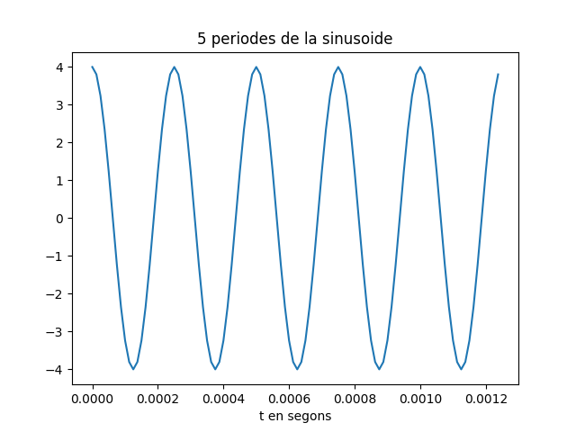
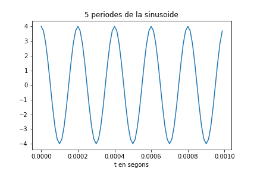
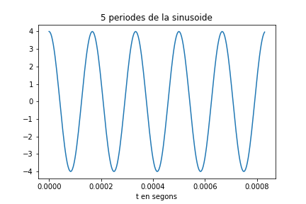
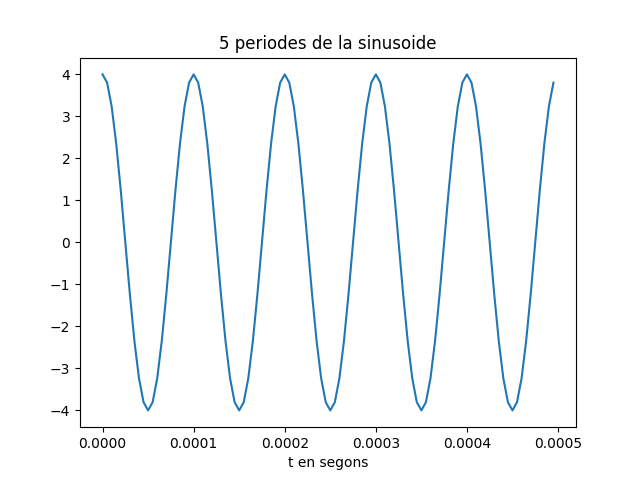
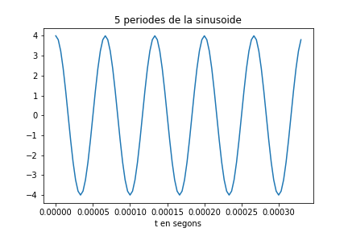
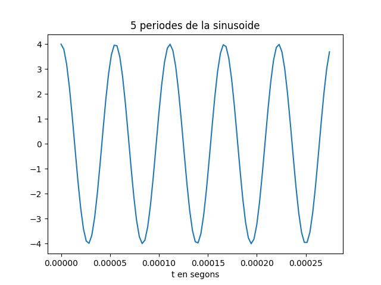
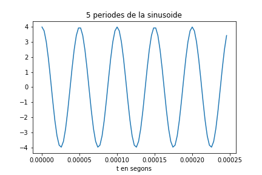
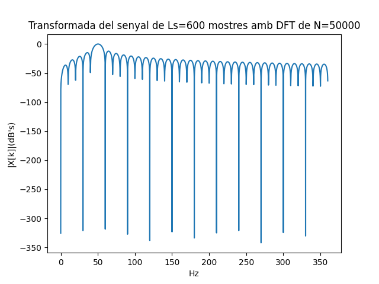

# Primera tasca APA 2023: Anàlisi fitxer de so

## Nom i cognoms: Pol Raich i Víctor Pallàs

## Representació temporal i freqüencial de senyals d'àudio

### Domini temporal

Per llegir, escriure i representar un fitxer en format `*.wav` en python podem fem servir els següents mòduls:

- Numpy:

    ```python
    import numpy as np
    ```

- Matplotlib:

    ```python
    import matplotlib.pyplot as plt
    ```

- Soundfile:

    ```python
    import soundfile as sf
    ```

Per **crear** i **guardar** a un fitxer un senyal sinusoidal de freqüència `fx Hz`, digitalitzat a `fm Hz`, de durada `T` segons i amplitud
`A` fem:

```python
T= 2.5                               # Durada de T segons
fm=8000                              # Freqüència de mostratge en Hz
fx=440                               # Freqüència de la sinusoide
A=4                                  # Amplitud de la sinusoide
pi=np.pi                             # Valor del número pi
L = int(fm * T)                      # Nombre de mostres del senyal digital
Tm=1/fm                              # Període de mostratge
t=Tm*np.arange(L)                    # Vector amb els valors de la variable temporal, de 0 a T
x = A * np.cos(2 * pi * fx * t)      # Senyal sinusoidal
sf.write('wav/so_exemple1.wav', x, fm)   # Escriptura del senyal a un fitxer en format wav
```

El resultat és un fitxer guardat al directori de treball i que es pot reproduir amb qualsevol reproductor d'àudio

Per **representar** gràficament 5 períodes de senyal fem:

```python
Tx=1/fx                                   # Període del senyal
Ls=int(fm*5*Tx)                           # Nombre de mostres corresponents a 5 períodes de la sinusoide

plt.figure(0)                             # Nova figura
plt.plot(t[0:Ls], x[0:Ls])                # Representació del senyal en funció del temps
plt.xlabel('t en segons')                 # Etiqueta eix temporal
plt.title('5 periodes de la sinusoide')   # Títol del gràfic
plt.show()                                # Visualització de l'objecte gràfic. 
```

El resultat del gràfic és:


> Nota: Si es treballa amb ipython, es pot escriure %matplotlib i no cal posar el plt.show() per veure gràfics

El senyal es pot **escoltar (reproduir)** directament des de python important un entorn de treball amb els dispositius de so, com per
exemple `sounddevice`:

```python
import sounddevice as sd      # Importem el mòdul sounddevice per accedir a la tarja de so
sd.play(x, fm)                # Reproducció d'àudio
```

### Domini transformat

Domini transformat. Els senyals es poden analitzar en freqüència fent servir la Transformada Discreta de Fourier.

La funció que incorpora el paquet `numpy` al submòdul `fft` és `fft`:

```python
from numpy.fft import fft     # Importem la funció fft
N=5000                        # Dimensió de la transformada discreta
X=fft(x[0 : Ls], N)           # Càlcul de la transformada de 5 períodes de la sinusoide
```

I podem representar el mòdul i la fase, en funció de la posició de cada valor amb:

```python
k=np.arange(N)                        # Vector amb els valors 0≤  k<N

plt.figure(1)                         # Nova figura
plt.subplot(211)                      # Espai per representar el mòdul
plt.plot(k,abs(X))                    # Representació del mòdul de la transformada
plt.title(f'Transformada del senyal de Ls={Ls} mostres amb DFT de N={N}')   # Etiqueta del títol
plt.ylabel('|X[k]|')                  # Etiqueta de mòdul
plt.subplot(212)                      # Espai per representar la fase
plt.plot(k,np.unwrap(np.angle(X)))    # Representació de la fase de la transformad, desenroscada
plt.xlabel('Index k')                 # Etiqueta de l'eix d'abscisses 
plt.ylabel('$\phi_x[k]$')             # Etiqueta de la fase en Latex
plt.show()                            # Per mostrar els grafics
```


## Proves i exercicis a fer i entregar

### 1. Reprodueix l'exemple fent servir diferents freqüències per la sinusoide. Al menys considera $f_x = 4$ kHz, a banda d'una freqüència pròpia en el marge audible. Comenta els resultats.

Farem proves amb freqüències des de $4$ kHz fins al límit audible $20$ kHz

### $f_x = 4$ kHz
```python
T= 2.5                               
fm=80000                                  # Freqüència de mostratge en Hz
fx=4000                                   # Freqüència de la sinusoide
A=4                                  
pi=np.pi                             
L = int(fm * T)                           # Nombre de mostres del senyal digital
Tm=1/fm                                   # Període de mostratge
t=Tm*np.arange(L)                         # Vector amb els valors de la variable temporal, de 0 a T
x = A * np.cos(2 * pi * fx * t)           # Senyal sinusoidal
sf.write('wav/so_4000.wav', x, fm)            # Escriptura del senyal a un fitxer en format wav
Tx=1/fx                                   # Període del senyal
Ls=int(fm*5*Tx)                           # Nombre de mostres corresponents a 5 períodes de la sinusoide

plt.figure(0)                             # Nova figura
plt.plot(t[0:Ls], x[0:Ls])                # Representació del senyal en funció del temps
plt.xlabel('t en segons')                 # Etiqueta eix temporal
plt.title('5 periodes de la sinusoide')   # Títol del gràfic
sd.play(x, fm)                            # Reproducció d'àudio
plt.show()
```

Gràfica resultant del codi anterior: 



Degut a que hem canviat la freqüència de la pròpia sinusoide, per a que es faci bé el mostreig i el sistema pugui escriure, reproduir i graficar la senyal correctament, hem de canviar la freqüència de mostreig també.

També ens adonem que com sempre volemrepresentem 5 períodes de les sinusoides, llavors l'escala de temps en segons de l'eix d'abscisses varia i cada vegada els salts son més petits, com estem augmentant la freqüència de la sinusoide en cada prova disminueix el període.
    
Farem el mateix amb totes les proves, per tant utilitzarem en cada una, una freqüència de mostreig que sabem de sobres que funcionarà.

### $f_x = 5$ kHz



### $f_x = 6$ kHz




### $f_x = 10$ kHz



A partir d'aquesta freqüència, els meus pares ja no escolten el senyal.

### $f_x = 15$ kHz




### $f_x = 18$ kHz



Podem arribar a escoltar aquest senyal si estem en silenci.

### $f_x = 20$ kHz



Podem arribar a escoltar vagament aquest senyal si estem en silenci absolut i pujem el volum del altaveu al màxim.

### 2. Modifica el programa per considerar com a senyal a analitzar el senyal del fitxer wav que has creat (`x_r, fm = sf.read('nom_fitxer.wav')`).


```python
fm = 9000
L = int(fm * T)
t = Tm*np.arange(L)
x_r, fm = sf.read('wav/so_4000.wav')
fx = 4000
Tx = 1/fx
Ls = int(fm*5*Tx)

plt.figure(7)
plt.ylim(bottom = -2, top = 2)
plt.plot(t[:Ls], x_r[:Ls])                
plt.xlabel('t en segons')                 
plt.title('5 periodes de la sinusoide')
plt.savefig('img/sinusoide_4kHz_remostrejada.png')
plt.show()

N = 5000
x_fft=fft(x_r[:Ls], N)

k = np.arange(N)
plt.figure(8)
plt.subplot(211)
plt.plot(k, abs(x_fft))
plt.title(f'Tranformada de Fourier')
plt.ylabel('|X[k]|')
plt.subplot(212)
plt.plot(k, np.unwrap(np.angle(x_fft)))
plt.xlabel('Index k')
plt.ylabel('$\phi_x[k]$')
plt.show
```
Gràfica resultant del codi anterior: 


### 3. Modifica el programa per representar el mòdul de la Transformada de Fourier en dB i l'eix d'abscisses en el marge de $0$ a $f_m/2$ en Hz. 

Per aquest exercici farem servir el to de 50 Hz de l'exercici 1, canviant la dimensió de la transformada discreta a N=50000, per poder visualitzar adequadament la gràfica:

```pyhton
T= 2.5 
fm = 6000
fz = 50                                                 # Frequencia del senyal
A = 4
L = int(fm * T)
pi = np.pi
Tm = 1 / fm
t = Tm * np.arange(L)
x_r = A * np.cos(2 * pi * f * t)                        # Senyal sinusoidal ex1
sf.write('so_ex1_50.wav', x_r, fm)                      # Creem un archiu a frequencia 50

Tz = 1 / fz
Ls = int(fm * 5 * Tz)

N = 50000
x_fft=fft(x_r[:Ls], N)
k = np.arange(N)
XdB = 20*np.log10(np.abs(x_fft) / max(np.abs(x_fft)))
fk = (k / N)*fm
plt.figure(9)
plt.title(f'Transformada del senyal de Ls={Ls} mostres amb DFT de N={N}')
plt.ylabel("|X[k]|(dB's)")
plt.plot(fk[0:int(fm/2)], XdB[0:int(fm/2)]) 
plt.xlabel('Hz')
plt.savefig('img/sinusoide_6KHz_YdB_XHz_.png')
plt.show
```
Gràfica resultant del codi anterior: 


  - Comprova que la mesura de freqüència es correspon amb la freqüència de la sinusoide que has fet servir.  
  
La mesura de la frequencia es correspon amb la freqüència de la sinusoide (50hz), ja que el seu pic (valor màxim d'àmplitud) al modul de la transformada està pel valor de 50Hz a l'eix X.  
    
  - Com pots identificar l'amplitud de la sinusoide a partir de la representació de la transformada? Comprova-ho amb el senyal generat.
  
L'amplitud màxima del mòdul és 0 dB. L'amplitud de la sinusoide equivaldrà a aquest valor passat a escala líneal: 10^(0/20) = 1 = Amplitud de la sinusoide.

> NOTES:
>
> - Per representar en dB has de fer servir la fórmula següent:
>
> $X_{dB}(f) = 20\log_{10}\left(\frac{\left|X(f)\right|}{\max(\left|X(f)\right|}\right)$
>
> - La relació entre els valors de l'índex k i la freqüència en Hz és:
>
> $f_k = \frac{k}{N} f_m$

### 4.Tria un fitxer d'àudio en format wav i mono (el pots aconseguir si en tens amb altres formats amb el programa Audacity).
Llegeix el fitxer d'àudio i comprova:

- Freqüència de mostratge.
- Nombre de mostres de senyal.
- Tria un segment de senyal de 25ms i insereix una gráfica amb la seva evolució temporal.
- Representa la seva transformada en dB en funció de la freqüència, en el marge $0\le f\le f_m/2$.
- Quines son les freqüències més importants del segment triat?