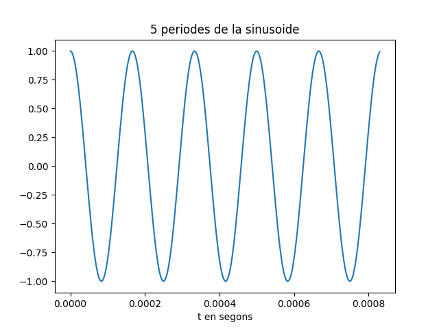
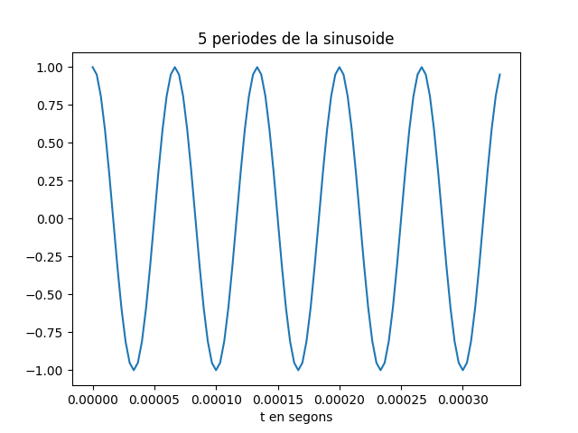
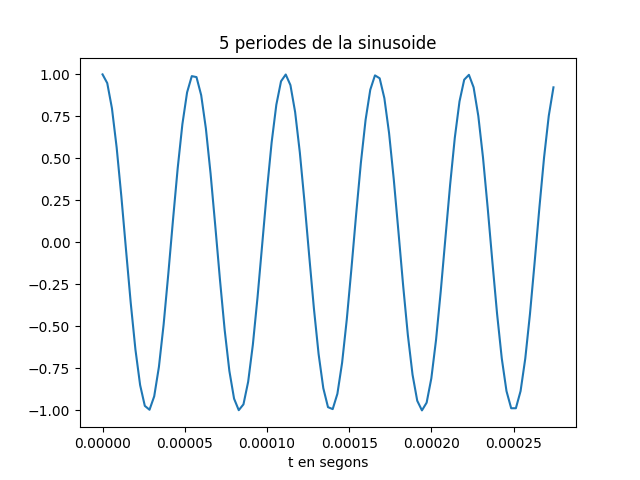

# Primera tasca APA 2023: Anàlisi fitxer de so

## Pol Raich i Víctor Pallàs


## Proves i exercicis a fer i entregar

### 1. Reprodueix l'exemple fent servir diferents freqüències per la sinusoide. Al menys considera $f_x = 4$ kHz, a banda d'una freqüència pròpia en el marge audible. Comenta els resultats.

Farem proves amb freqüències des de $4$ kHz fins al límit audible $20$ kHz

## $f_x = 4$ kHz

```python
import numpy as np
import matplotlib.pyplot as plt
import soundfile as sf
import sounddevice as sd

T= 2.5                               
fm=80000                                  # Freqüència de mostratge en Hz
fx=4000                                   # Freqüència de la sinusoide
A=4                                  
pi=np.pi                             
L = int(fm * T)                           # Nombre de mostres del senyal digital
Tm=1/fm                                   # Període de mostratge
t=Tm*np.arange(L)                         # Vector amb els valors de la variable temporal, de 0 a T
x = A * np.cos(2 * pi * fx * t)           # Senyal sinusoidal
sf.write('so_4000.wav', x, fm)            # Escriptura del senyal a un fitxer en format wav
Tx=1/fx                                   # Període del senyal
Ls=int(fm*5*Tx)                           # Nombre de mostres corresponents a 5 períodes de la sinusoide

plt.figure(0)                             # Nova figura
plt.plot(t[0:Ls], x[0:Ls])                # Representació del senyal en funció del temps
plt.xlabel('t en segons')                 # Etiqueta eix temporal
plt.title('5 periodes de la sinusoide')   # Títol del gràfic
sd.play(x, fm)                            # Reproducció d'àudio
plt.show()
```


Degut a que hem canviat la freqüència de la pròpia sinusoide, per a que es faci bé el mostreig i el sistema pugui escriure, reproduir i graficar la senyal correctament, hem de canviar la freqüència de mostreig també.

També ens adonem que com sempre volemrepresentem 5 períodes de les sinusoides, llavors l'escala de temps en segons de l'eix d'abscisses varia i cada vegada els salts son més petits, com estem augmentant la freqüència de la sinusoide en cada prova disminueix el període.
    
Farem el mateix amb totes les proves, per tant utilitzarem en cada una, una freqüència de mostreig que sabem de sobres que funcionarà.

## $f_x = 5$ kHz
```python
T= 2.5                                    # Durada de T segons
fm=80000                                  # Freqüència de mostratge en Hz
fx=5000                                   # Freqüència de la sinusoide
A=4                                       # Amplitud de la sinusoide
pi=np.pi                                  # Valor del número pi
L = int(fm * T)                           # Nombre de mostres del senyal digital
Tm=1/fm                                   # Període de mostratge
t=Tm*np.arange(L)                         # Vector amb els valors de la variable temporal, de 0 a T
x = A * np.cos(2 * pi * fx * t)           # Senyal sinusoidal
sf.write('so_5000.wav', x, fm)            # Escriptura del senyal a un fitxer en format wav
Tx=1/fx                                   # Període del senyal
Ls=int(fm*5*Tx)                           # Nombre de mostres corresponents a 5 períodes de la sinusoide
plt.figure(0)                             # Nova figura
plt.plot(t[0:Ls], x[0:Ls])                # Representació del senyal en funció del temps
plt.xlabel('t en segons')                 # Etiqueta eix temporal
plt.title('5 periodes de la sinusoide')   # Títol del gràfic
sd.play(x, fm)                            # Reproducció d'àudio
plt.savefig('img/sinusoide_5kHz.png')
plt.show()
```


## $f_x = 6$ kHz
```python
T= 2.5                                    # Durada de T segons
fm=300000                                  # Freqüència de mostratge en Hz
fx=6000                                   # Freqüència de la sinusoide
A=4                                       # Amplitud de la sinusoide
pi=np.pi                                  # Valor del número pi
L = int(fm * T)                           # Nombre de mostres del senyal digital
Tm=1/fm                                   # Període de mostratge
t=Tm*np.arange(L)                         # Vector amb els valors de la variable temporal, de 0 a T
x = A * np.cos(2 * pi * fx * t)           # Senyal sinusoidal
sf.write('so_6000.wav', x, fm)            # Escriptura del senyal a un fitxer en format wav
Tx=1/fx                                   # Període del senyal
Ls=int(fm*5*Tx)                           # Nombre de mostres corresponents a 5 períodes de la sinusoide
plt.figure(0)                             # Nova figura
plt.plot(t[0:Ls], x[0:Ls])                # Representació del senyal en funció del temps
plt.xlabel('t en segons')                 # Etiqueta eix temporal
plt.title('5 periodes de la sinusoide')   # Títol del gràfic
sd.play(x, fm)                            # Reproducció d'àudio
plt.savefig('img/sinusoide_6kHz.png')
plt.show()
```



## $f_x = 10$ kHz
```python
T= 2.5                                    # Durada de T segons
fm=200000                                 # Freqüència de mostratge en Hz
fx=10000                                  # Freqüència de la sinusoide
A=4                                       # Amplitud de la sinusoide
pi=np.pi                                  # Valor del número pi
L = int(fm * T)                           # Nombre de mostres del senyal digital
Tm=1/fm                                   # Període de mostratge
t=Tm*np.arange(L)                         # Vector amb els valors de la variable temporal, de 0 a T
x = A * np.cos(2 * pi * fx * t)           # Senyal sinusoidal
sf.write('so_10000.wav', x, fm)           # Escriptura del senyal a un fitxer en format wav
Tx=1/fx                                   # Període del senyal
Ls=int(fm*5*Tx)                           # Nombre de mostres corresponents a 5 períodes de la sinusoide
plt.figure(0)                             # Nova figura
plt.plot(t[0:Ls], x[0:Ls])                # Representació del senyal en funció del temps
plt.xlabel('t en segons')                 # Etiqueta eix temporal
plt.title('5 periodes de la sinusoide')   # Títol del gràfic
sd.play(x, fm)                            # Reproducció d'àudio
plt.savefig('img/sinusoide_10kHz.png')    # Escriptura de la gràfica del senyal en un fitxer png
plt.show()
```


A partir d'aquesta freqüència, els meus pares ja no escolten el senyal.

## $f_x = 15$ kHz
```python
T= 2.5                                    # Durada de T segons
fm=300000                                 # Freqüència de mostratge en Hz
fx=15000                                  # Freqüència de la sinusoide
A=4                                       # Amplitud de la sinusoide
pi=np.pi                                  # Valor del número pi
L = int(fm * T)                           # Nombre de mostres del senyal digital
Tm=1/fm                                   # Període de mostratge
t=Tm*np.arange(L)                         # Vector amb els valors de la variable temporal, de 0 a T
x = A * np.cos(2 * pi * fx * t)           # Senyal sinusoidal
sf.write('so_15000.wav', x, fm)           # Escriptura del senyal a un fitxer en format wav
Tx=1/fx                                   # Període del senyal
Ls=int(fm*5*Tx)                           # Nombre de mostres corresponents a 5 períodes de la sinusoide
plt.figure(0)                             # Nova figura
plt.plot(t[0:Ls], x[0:Ls])                # Representació del senyal en funció del temps
plt.xlabel('t en segons')                 # Etiqueta eix temporal
plt.title('5 periodes de la sinusoide')   # Títol del gràfic
sd.play(x, fm)                            # Reproducció d'àudio
plt.savefig('img/sinusoide_15kHz.png')    # Escriptura de la gràfica del senyal en un fitxer png
plt.show()
```



## $f_x = 18$ kHz
```python
T= 2.5                                    # Durada de T segons
fm=350000                                 # Freqüència de mostratge en Hz
fx=18000                                  # Freqüència de la sinusoide
A=4                                       # Amplitud de la sinusoide
pi=np.pi                                  # Valor del número pi
L = int(fm * T)                           # Nombre de mostres del senyal digital
Tm=1/fm                                   # Període de mostratge
t=Tm*np.arange(L)                         # Vector amb els valors de la variable temporal, de 0 a T
x = A * np.cos(2 * pi * fx * t)           # Senyal sinusoidal
sf.write('so_18000.wav', x, fm)           # Escriptura del senyal a un fitxer en format wav
Tx=1/fx                                   # Període del senyal
Ls=int(fm*5*Tx)                           # Nombre de mostres corresponents a 5 períodes de la sinusoide
plt.figure(0)                             # Nova figura
plt.plot(t[0:Ls], x[0:Ls])                # Representació del senyal en funció del temps
plt.xlabel('t en segons')                 # Etiqueta eix temporal
plt.title('5 periodes de la sinusoide')   # Títol del gràfic
sd.play(x, fm)                            # Reproducció d'àudio
plt.savefig('img/sinusoide_18kHz.png')    # Escriptura de la gràfica del senyal en un fitxer png
plt.show()
```


Podem arribar a escoltar aquest senyal si estem en silenci.

## $f_x = 20$ kHz
```python
T= 2.5                                    # Durada de T segons
fm=350000                                 # Freqüència de mostratge en Hz
fx=20000                                  # Freqüència de la sinusoide
A=4                                       # Amplitud de la sinusoide
pi=np.pi                                  # Valor del número pi
L = int(fm * T)                           # Nombre de mostres del senyal digital
Tm=1/fm                                   # Període de mostratge
t=Tm*np.arange(L)                         # Vector amb els valors de la variable temporal, de 0 a T
x = A * np.cos(2 * pi * fx * t)           # Senyal sinusoidal
sf.write('so_20000.wav', x, fm)           # Escriptura del senyal a un fitxer en format wav
Tx=1/fx                                   # Període del senyal
Ls=int(fm*5*Tx)                           # Nombre de mostres corresponents a 5 períodes de la sinusoide
plt.figure(0)                             # Nova figura
plt.plot(t[0:Ls], x[0:Ls])                # Representació del senyal en funció del temps
plt.xlabel('t en segons')                 # Etiqueta eix temporal
plt.title('5 periodes de la sinusoide')   # Títol del gràfic
sd.play(x, fm)                            # Reproducció d'àudio
plt.savefig('img/sinusoide_20kHz.png')    # Escriptura de la gràfica del senyal en un fitxer png
plt.show()
```


Podem arribar a escoltar vagament aquest senyal si estem en silenci absolut i pujem el volum del altaveu al màxim.

### 2. Modifica el programa per considerar com a senyal a analitzar el senyal del fitxer wav que has creat (`x_r, fm = sf.read('nom_fitxer.wav')`).

